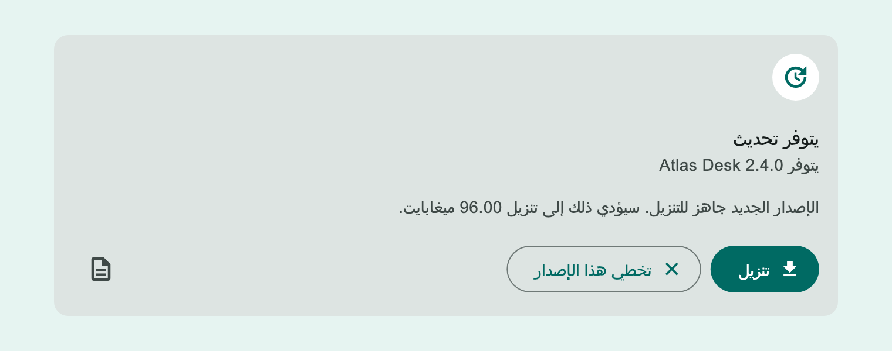
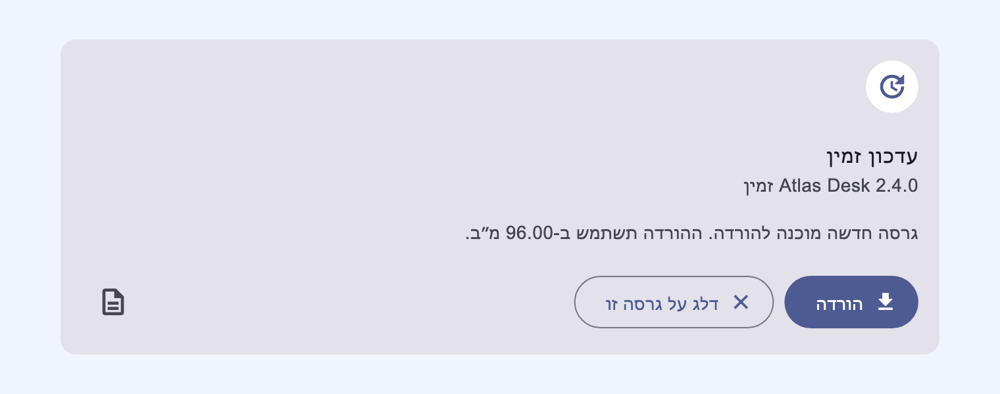
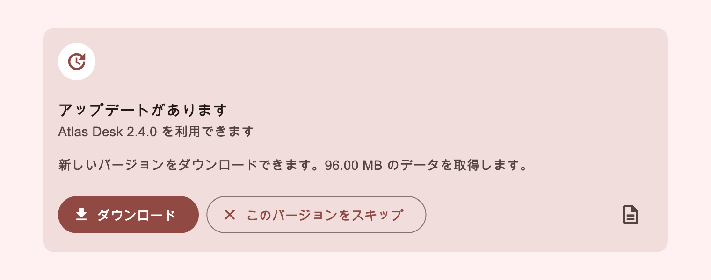
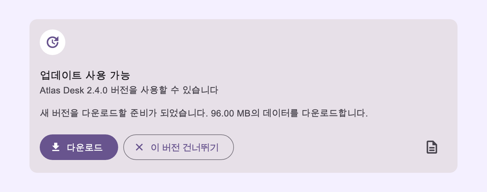
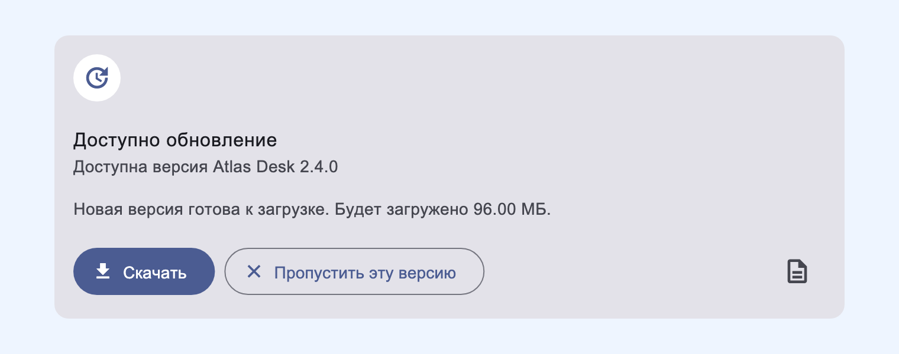

# Localization and i18n

desktop_updater keeps localization separate from update mechanics. Apps can use
the package's bundled starter translations, load their own JSON files, pass
direct string overrides, or connect the ready-made UI to an existing i18n
resolver such as `AppLocalizations`, `_()`, `easy_localization`, or another
app-owned translation layer.

The package always keeps an English fallback. Missing JSON keys do not make the
ready-made UI blank.

## Recommended setup

For most apps, start with the bundled locale that matches the system or app
locale, then override only the product-specific copy:

```dart
final localization =
    await DesktopUpdateLocalizationLoader.fromPlatformLocale(
  overrides: const DesktopUpdateLocalization(
    restartText: "Install update",
    releaseNotesButtonTooltipText: "What's new",
  ),
);

final controller = DesktopUpdaterController(
  appArchiveUrl: Uri.parse("https://updates.example.com/app-archive.json"),
  localization: localization,
);
```

Use this shape when:

- you want package-managed starter translations;
- you want automatic locale fallback such as `pt-BR -> pt -> en`;
- you only need a few app-specific wording overrides;
- you want RTL languages such as Arabic and Hebrew to flip the ready-made UI
  direction automatically.

The merge order is:

```text
English defaults < bundled JSON or custom JSON < explicit overrides
```

That means `overrides` is intentionally last. It lets an app keep the package
translation but still replace one button label, tooltip, or release-notes label.

## Visual examples

These screenshots are generated from the real `DesktopUpdateDirectCard` widget,
not from hand-drawn mockups.

### Arabic, RTL



Arabic is inferred as `TextDirection.rtl` from the `ar` locale, unless the JSON
sets `textDirection` explicitly.

### Hebrew, RTL



Hebrew is also inferred as `TextDirection.rtl`. The ready-made card wraps its
localized surface with `Directionality`, so button order, icon placement, and
text alignment follow the localized direction.

### Japanese



Japanese remains left-to-right for layout direction while rendering CJK text.

### Korean



Korean follows the same left-to-right layout direction.

### Cyrillic



Cyrillic locales such as Russian, Ukrainian, Kazakh, Kyrgyz, Bashkir, Tatar,
Sakha, Tuvan, and others are left-to-right unless a locale/script explicitly
requires otherwise.

## Bundled package translations

Bundled JSON files live inside the package at:

```text
assets/localizations/<locale>.json
```

Apps do not need to add these package assets to their own `pubspec.yaml`.
Load them through the loader:

```dart
final localization =
    await DesktopUpdateLocalizationLoader.fromBundledLocale("fr");
```

The loader accepts either a string tag or a Flutter `Locale`:

```dart
await DesktopUpdateLocalizationLoader.fromBundledLocale("pt-BR");
await DesktopUpdateLocalizationLoader.fromBundledLocale(
  const Locale.fromSubtags(languageCode: "zh", scriptCode: "Hans"),
);
```

Locale fallback is exact tag first, then language code, then English:

```text
pt-BR -> pt -> en
zh-Hans -> zh -> en
az-Arab -> az -> en
```

Current bundled files:

```text
ar, az, ba, crh, cv, de, en, es, fa, fr, gag, he, hi, it, ja, kaa,
kjh, kk, ko, krc, kum, ky, nl, nog, pl, pt, pt-BR, ru, sah, tk, tr,
tt, tyv, ug, uk, uz, zh-Hans, zh-Hant
```

`en` is the canonical fallback. Some bundled locales are starter translations
and include `translationQuality: "machine-starter"` in their JSON. Treat those
as a useful first pass, review the wording before production, and use overrides
or custom JSON for app-specific copy.

## App-owned JSON

Use app-owned JSON when the app wants to ship its own translation files, fix a
bundled starter translation without waiting for a package release, or keep
desktop_updater copy in the same asset structure as the rest of the app.

Add the assets to the app's `pubspec.yaml`:

```yaml
flutter:
  assets:
    - assets/i18n/desktop_updater/
```

Load the app asset:

```dart
final localization = await DesktopUpdateLocalizationLoader.fromAsset(
  "assets/i18n/desktop_updater/ar.json",
);
```

You can still override individual strings after loading the JSON:

```dart
final localization = await DesktopUpdateLocalizationLoader.fromAsset(
  "assets/i18n/desktop_updater/fr.json",
  overrides: const DesktopUpdateLocalization(
    restartText: "Installer maintenant",
  ),
);
```

Use the optional `package` argument only when the JSON lives in another package:

```dart
final localization = await DesktopUpdateLocalizationLoader.fromAsset(
  "assets/desktop_updater/fr.json",
  package: "my_company_i18n",
);
```

## JSON schema

The root object is intentionally small:

```json
{
  "schemaVersion": 1,
  "locale": "ar",
  "textDirection": "rtl",
  "translationQuality": "human-reviewed",
  "strings": {
    "updateAvailableText": "يتوفر تحديث",
    "newVersionAvailableText": "يتوفر {} {}",
    "newVersionLongText": "الإصدار الجديد جاهز للتنزيل. سيؤدي ذلك إلى تنزيل {} ميغابايت.",
    "downloadText": "تنزيل",
    "restartText": "إعادة التشغيل للتحديث",
    "skipThisVersionText": "تخطي هذا الإصدار",
    "releaseNotesButtonTooltipText": "ملاحظات الإصدار",
    "releaseNotesTypeLabels": {
      "feat": "ميزات جديدة",
      "fix": "إصلاحات",
      "other": "تغييرات أخرى"
    },
    "releaseNotesSectionLabels": {
      "features": "ميزات",
      "fixes": "إصلاحات",
      "security": "الأمان",
      "breaking": "تغييرات كاسرة",
      "other": "تغييرات أخرى"
    }
  }
}
```

Supported top-level fields:

- `schemaVersion`: current value is `1`.
- `locale`: BCP-47 style locale tag such as `ar`, `he`, `pt-BR`,
  `zh-Hans`, or `az-Arab`.
- `textDirection`: optional explicit value, either `ltr` or `rtl`.
- `translationQuality`: optional metadata for humans. The loader ignores it.
- `strings`: localized ready-made UI strings and maps.

Supported `strings` keys:

```text
updateAvailableText
newVersionAvailableText
newVersionLongText
restartText
warningTitleText
restartWarningText
warningCancelText
warningConfirmText
skipThisVersionText
downloadText
upToDateTitleText
upToDateText
updateCheckFailedTitleText
updateCheckFailedText
okText
updateFailedTooltipText
releaseNotesButtonTooltipText
releaseNotesTitleText
releaseNotesTypeLabels
releaseNotesSectionLabels
releaseNotesErrorText
releaseNotesRetryText
releaseNotesEmptyText
```

Placeholders use `{}` and are replaced in order. Keep the placeholder count
when translating:

- `newVersionAvailableText`: first `{}` is app name, second `{}` is version.
- `newVersionLongText`: `{}` is download size in megabytes.
- `upToDateText`: `{}` is the latest version.

## Existing app i18n resolver

If the app already owns all translations, use a resolver instead of JSON. This
is useful for apps that prefer `_('key')`, generated `AppLocalizations`, remote
copy, or any other in-house i18n layer.

```dart
final localization = DesktopUpdateLocalization.resolvedBy(
  textDirection: Directionality.of(context),
  translate: (key, fallback) {
    return switch (key) {
      DesktopUpdateLocalizationKey.updateAvailableText =>
        AppLocalizations.of(context).desktopUpdaterUpdateAvailable,
      DesktopUpdateLocalizationKey.downloadText =>
        AppLocalizations.of(context).desktopUpdaterDownload,
      DesktopUpdateLocalizationKey.restartText =>
        AppLocalizations.of(context).desktopUpdaterRestart,
      _ => fallback,
    };
  },
);
```

For `_('string')` style APIs, map the stable enum keys to app-owned message
IDs:

```dart
final localization = DesktopUpdateLocalization.resolvedBy(
  textDirection: Directionality.of(context),
  translate: (key, fallback) {
    final translated = _("desktopUpdater.${key.name}");
    return translated.isEmpty ? fallback : translated;
  },
);
```

Resolver strings should still keep `{}` placeholders where the ready-made UI
expects runtime values.

## Direct overrides

Use direct overrides for a small amount of copy, especially product terminology
that should not live in generic package translations:

```dart
localization: const DesktopUpdateLocalization(
  updateAvailableText: "A new Atlas Desk build is ready",
  downloadText: "Download build",
  skipThisVersionText: "Skip build",
);
```

Direct overrides are synchronous, const-friendly, and fully backward
compatible with the older customization style.

## Runtime language changes

`DesktopUpdaterController.localization` is settable. Changing it notifies the
ready-made UI, so a settings screen can switch language without rebuilding the
controller:

```dart
Future<void> applyUpdaterLocale(Locale locale) async {
  final localization =
      await DesktopUpdateLocalizationLoader.fromBundledLocale(
    locale,
    overrides: const DesktopUpdateLocalization(
      releaseNotesButtonTooltipText: "Release notes",
    ),
  );

  controller.localization = localization;
}
```

If the app uses `Localizations.localeOf(context)`, load from context after the
widget is under `MaterialApp` or another `Localizations` provider:

```dart
Future<void> syncUpdaterLocale(BuildContext context) async {
  controller.localization =
      await DesktopUpdateLocalizationLoader.fromContext(context);
}
```

Do not start asynchronous asset loading inside `build` without caching the
future. Prefer `initState`, `didChangeDependencies`, a settings controller, or a
small `FutureBuilder` boundary owned by the app.

## Text direction and RTL

The loader determines text direction in this order:

1. explicit JSON `textDirection`;
2. script subtag, such as `Arab` or `Hebr` for RTL and `Cyrl`, `Latn`,
   `Hans`, or `Hant` for LTR;
3. language code, such as `ar`, `fa`, `he`, `ug`, or `ur` for RTL;
4. left-to-right fallback for all other locales.

Examples:

```text
ar -> rtl
he -> rtl
fa -> rtl
ug -> rtl
az-Arab -> rtl
az-Latn -> ltr
ru -> ltr
kk-Cyrl -> ltr
ja -> ltr
ko -> ltr
zh-Hans -> ltr
zh-Hant -> ltr
```

The ready-made card, dialog, and release-notes sheet apply the localization's
direction locally. This keeps updater UI correct even when the rest of the app
is still in a different direction.

When using `DesktopUpdateLocalization.resolvedBy`, pass the app's current text
direction explicitly:

```dart
DesktopUpdateLocalization.resolvedBy(
  textDirection: Directionality.of(context),
  translate: translateDesktopUpdaterKey,
);
```

## Regenerating screenshots

Maintainers can regenerate the images in this page with:

```sh
flutter test --no-pub tool/localization_screenshots_test.dart
```

The generator loads local system fonts so Arabic, Hebrew, Japanese, Korean, and
Cyrillic text render as real glyphs in the saved PNG files. It writes images to
`docs/assets/localization/`.
