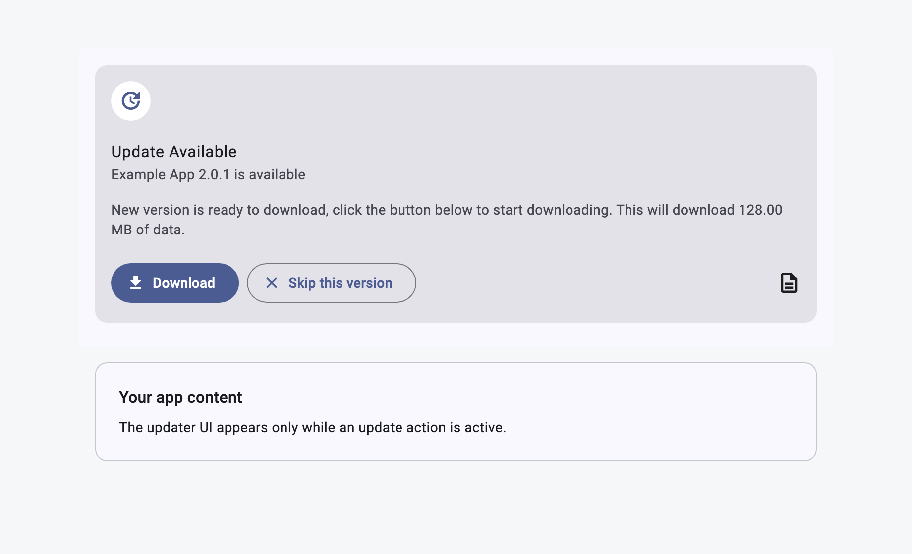
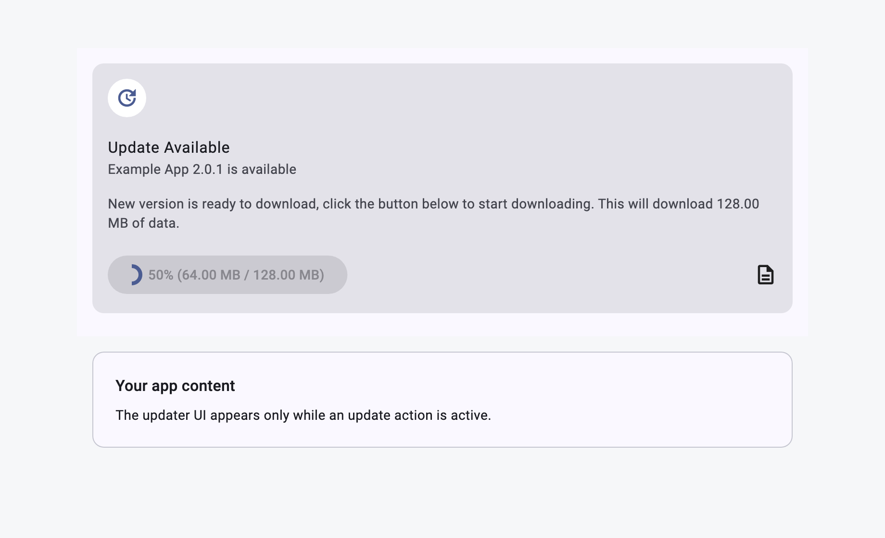
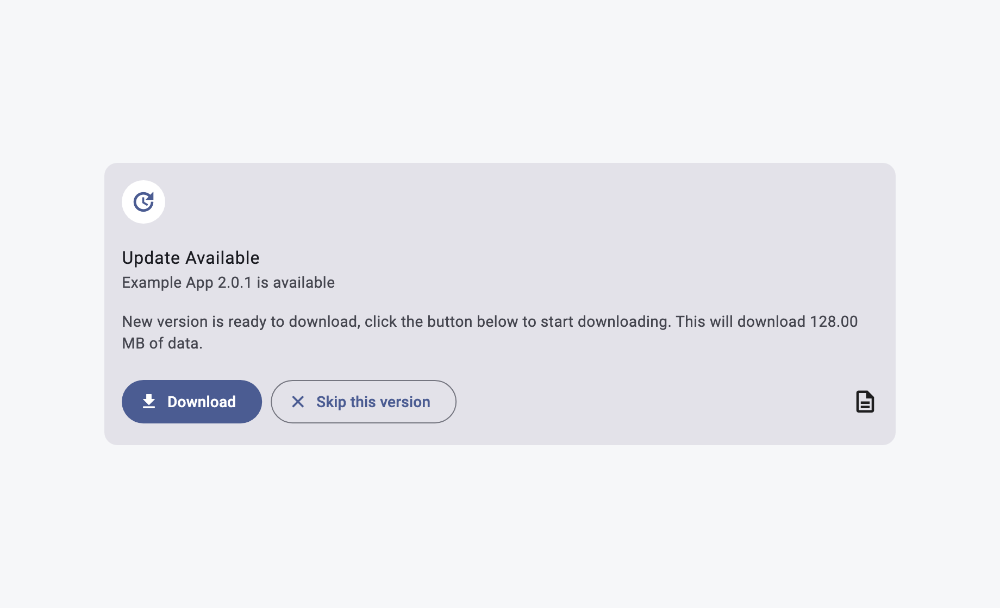
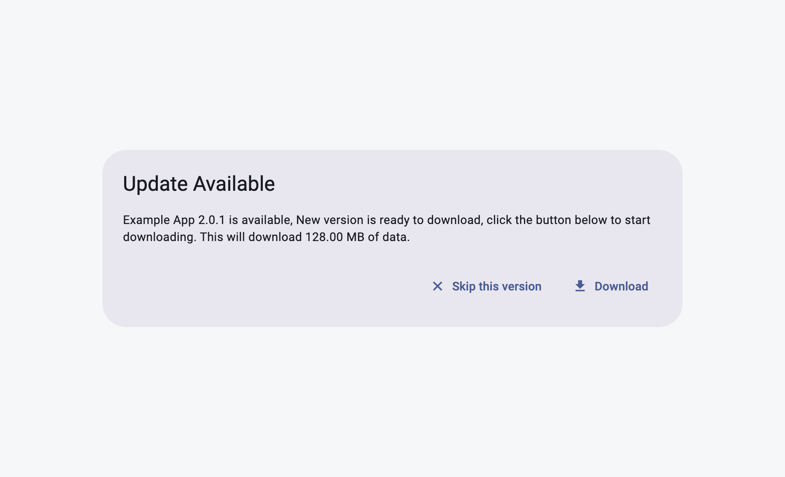
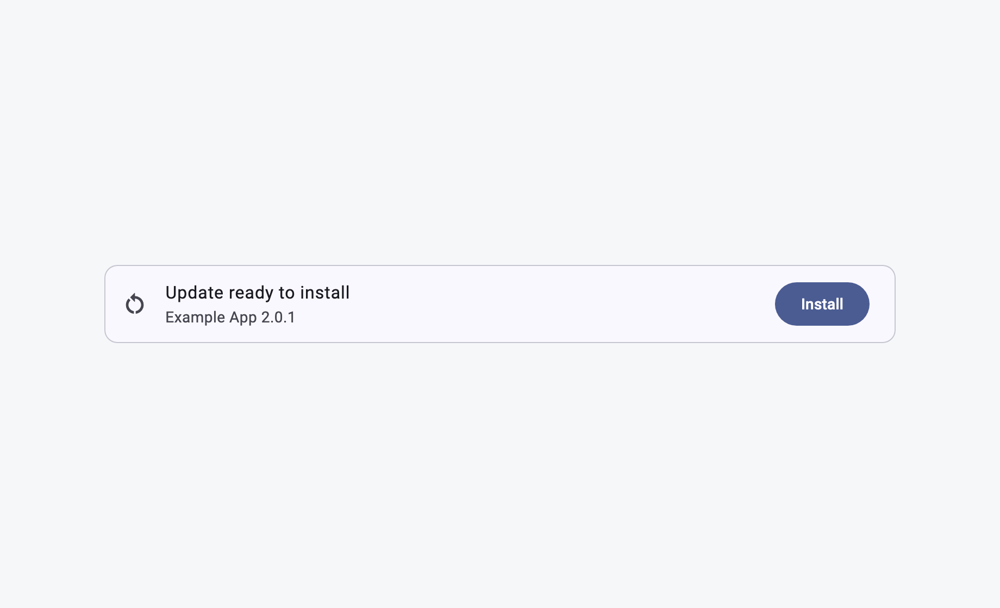

# Ready-Made UI Widgets

desktop_updater ships several UI surfaces on purpose. They all read the same
`DesktopUpdaterController` state, but they fit different app shells: a plain
`Scaffold` body, an existing `CustomScrollView`, a modal update prompt, or a
fully custom product surface.

This split keeps update mechanics consistent without forcing every desktop app
to restructure its layout. The ready-made widgets stay hidden while the updater
is idle or the user has skipped the version, then appear only when there is an
actionable update state.

## Why There Are Multiple Widgets

- Some apps need an inline card above their main content.
- Some apps already own their scroll view and only need a sliver.
- Some apps want an interruptive dialog for important update prompts.
- Some apps need custom UI but still want the package to provide state and
  actions.
- The same controller state drives every surface, so download, skip, restart,
  mandatory update, and failure behavior stays aligned.

## `DesktopUpdateWidget`

`DesktopUpdateWidget` is the simplest stock wrapper. It creates a
`CustomScrollView`, places `DesktopUpdateSliver` first, and renders your child
below it.



Use it when your screen can let the updater own the top-level scroll container.
It is best for simple pages, settings screens, or apps that do not already have
a custom sliver layout.

```dart
DesktopUpdateWidget(
  controller: controller,
  child: const YourHomePage(),
)
```

Why it exists: the common "show update UI above my app content" case should be
one widget, not a hand-built `CustomScrollView` in every app.

## `DesktopUpdateSliver`

`DesktopUpdateSliver` is the scroll-native version. It reveals the same stock
card inside a large sliver app bar when the controller is in an active update
state.



Use it when your app already uses a `CustomScrollView` and you want the update
surface to participate in the same scroll layout as the rest of the page.

```dart
CustomScrollView(
  slivers: [
    DesktopUpdateSliver(controller: controller),
    const SliverToBoxAdapter(child: YourHomePage()),
  ],
)
```

Why it exists: sliver-based desktop screens should not need an extra nested
scroll view just to show update UI.

## `DesktopUpdateDirectCard`

`DesktopUpdateDirectCard` shows the stock card exactly where you place it. It
wraps `UpdateCard` in `DesktopUpdaterInheritedNotifier`, so you can drop it into
an existing `Column`, `ListView`, side panel, settings page, or dashboard slot.



Use it when your app already owns the page structure and you only want the
updater card as one child in that structure.

```dart
Column(
  children: [
    DesktopUpdateDirectCard(controller: controller),
    const Expanded(child: YourHomePage()),
  ],
)
```

Why it exists: many desktop apps already have a layout and should not have to
adopt the package's scroll wrapper to use the stock UI.

## `UpdateCard`

`UpdateCard` is the shared Material card used by the direct card and sliver
surfaces. It can read an explicit `controller` or the nearest
`DesktopUpdaterInheritedNotifier`.

Use it directly when you need tighter control over inherited scope or card
margin:

```dart
DesktopUpdaterInheritedNotifier(
  controller: controller,
  child: const UpdateCard(
    margin: EdgeInsets.all(12),
  ),
)
```

Why it exists: it keeps the visual card implementation reusable while the
wrapper widgets handle placement.

`UpdateCard` switches its actions from the typed update state:

- `UpdateAvailable`: shows download and, when optional, skip actions.
- `UpdateDownloading`: shows a progress action.
- `UpdateReadyToInstall`: shows the restart/install action.
- `UpdateFailed`: shows a retry action and, when a diagnostics report exists,
  a "View report" action.

## `UpdateDialogListener` And Dialog Helpers

`UpdateDialogListener` is an invisible listener. Place it in your widget tree and
it opens `UpdateDialogWidget` after the current frame when an update becomes
available.



Use it when an available update should become a modal prompt instead of an
inline surface.

```dart
Stack(
  children: [
    const YourHomePage(),
    UpdateDialogListener(controller: controller),
  ],
)
```

Why it exists: some apps want update discovery to interrupt the current screen,
while others prefer quiet inline UI. The listener keeps that choice explicit.
It also guards against duplicate dialogs while the same update request is
already being shown.

You can also open the dialog yourself:

```dart
await showUpdateDialog<void>(
  context,
  controller: controller,
);
```

For user-triggered update checks, use `checkForUpdates()` and show feedback for
all outcomes:

```dart
final result = await controller.checkForUpdates();

await showManualUpdateCheckResultDialog(
  context,
  controller: controller,
  result: result,
);
```

Why this helper exists: automatic startup checks should usually stay quiet when
nothing is available, but a manual "Check for updates" button should still be
able to tell the user "up to date" or "check failed".

Automatic startup checks also stay quiet when the version check itself fails.
The controller still moves to `UpdateFailed`, so inline surfaces and custom
state UI can show retry affordances, but the initial `init()` check does not
throw into app startup. For strict flows, explicitly `await
controller.checkVersion()` and handle the thrown error. For user-triggered
checks, prefer `checkForUpdates()`, which returns `ManualUpdateCheckFailed`
instead of throwing.

## Update Problem Reports

When a check, download, verification, staging, or install handoff fails, the
controller builds a local `UpdateProblemReport` and attaches it to
`UpdateFailed.report`. The report is kept in memory, bounded to a safe entry
count, and redacted before `toPlainText()` is copied or exported. The package
does not write report files, upload logs, or include a reporting backend.

Stock UI shows "View report" only when `UpdateFailed.report` is available. The
dialog starts with a short user-facing summary, keeps technical details
collapsed, and lets the user copy the redacted report. The "Report issue" action
is hidden unless your app supplies `onProblemReport`.

```dart
final controller = DesktopUpdaterController(
  appArchiveUrl: archiveUrl,
  onProblemReport: (report) async {
    await myIssueReporter.send(report.toPlainText());
  },
);
```

Use `onProblemReport` for app-owned integrations such as Sentry, email,
pre-filled issue forms, customer support tickets, or your own API. It is invoked
only after an explicit user action in the report dialog.

Custom UI can open the same dialog:

```dart
if (controller.state case UpdateFailed(:final report) when report != null) {
  await showUpdateProblemReportDialog(
    context,
    controller: controller,
    report: report,
  );
}
```

## Runtime Extension Points

The controller keeps skip, retry, and telemetry behavior optional so apps do not
need to adopt a storage or analytics package just to use the updater.

Skip preferences are in-memory by default. To persist "skip this version"
across controller recreation, provide an app-owned `UpdatePreferences` adapter:

```dart
final controller = DesktopUpdaterController(
  appArchiveUrl: Uri.parse("https://updates.example.com/app-archive.json"),
  preferences: MyUpdatePreferencesStore(),
);
```

The adapter stores one skipped version per channel with
`skippedVersion({required channel})`,
`skipVersion({required version, required channel})`, and
`clearSkippedVersion({required channel})`. Mandatory updates ignore skipped
versions.

Staged rollouts use an app-owned stable identity. Pass an opaque
`installationIdentity` when you want `rollout.percentage` metadata in
`app-archive.json` to filter update eligibility:

```dart
final controller = DesktopUpdaterController(
  appArchiveUrl: archiveUrl,
  installationIdentity: myInstallIdentity,
);
```

Use a generated install ID or hashed app-owned identifier. Avoid emails, license
keys, names, or support IDs. Without an identity, partial rollout items are
ignored; full rollout and non-rollout items still work normally.

Telemetry is also app-owned. Pass a callback to receive typed lifecycle events
such as `checkStarted`, `checkFailed`, `updateSelected`, `downloadStarted`,
`downloadFailed`, `artifactVerified`, `installScheduled`, and `installFailed`:

```dart
final controller = DesktopUpdaterController(
  appArchiveUrl: archiveUrl,
  telemetry: (event) {
    analytics.record("desktop_update_${event.type.name}");
  },
);
```

Telemetry callback failures are ignored by the updater. The callback is for
observation only and is never required for update checks, downloads, or install
handoff.

Install scheduling also keeps a small cleanup report in memory. Read
`controller.lastCleanupReport` after `restartApp()` or pass `onCleanupReport`
to persist the staging path, descriptor version, cleanup status, native rollback
status when known, and error text when scheduling or cleanup fails:

```dart
final controller = DesktopUpdaterController(
  appArchiveUrl: archiveUrl,
  onCleanupReport: (report) async {
    await myReleaseAuditStore.save(report);
  },
);
```

The callback is observational. If it throws or your persistence backend is
unavailable, the updater still treats install scheduling according to the
native helper result.

Apps that want a durable lifecycle log can supply an app-owned diagnostics
recorder with a sink. The package forwards redacted entries but does not choose
a file path, retention policy, upload target, or storage package:

```dart
class AppUpdateLogSink implements UpdateDiagnosticsSink {
  AppUpdateLogSink(this.file);
  final File file;

  @override
  void record(UpdateDiagnosticEntry entry) {
    file.writeAsStringSync(
      "${entry.toRedactedLogLine()}\n",
      mode: FileMode.append,
      flush: true,
    );
  }
}

final controller = DesktopUpdaterController(
  appArchiveUrl: archiveUrl,
  diagnosticsRecorder: UpdateDiagnosticsRecorder(
    sink: AppUpdateLogSink(appOwnedLogFile),
  ),
);
```

Sink failures are ignored by the updater. In-memory problem reports remain
available even when the app-owned log destination cannot be written.

If your app wants to enforce descriptor `minimumOS` metadata, provide a
deterministic policy callback:

```dart
final controller = DesktopUpdaterController(
  appArchiveUrl: archiveUrl,
  isMinimumOSSupported: ({required platform, required minimumOS}) {
    return myRuntimePolicy.supports(platform, minimumOS);
  },
);
```

When the callback returns false for the current platform, the descriptor is
skipped. If no callback is supplied, `minimumOS` is parsed and preserved but not
enforced by the controller.

## Custom UI With `DesktopUpdaterInheritedNotifier`

For product-specific UI, wrap your own widget with
`DesktopUpdaterInheritedNotifier` and switch on the typed controller state.



```dart
DesktopUpdaterInheritedNotifier(
  controller: controller,
  child: Builder(
    builder: (context) {
      final updater = DesktopUpdaterInheritedNotifier.of(context).notifier!;

      return switch (updater.state) {
        UpdateAvailable(:final mandatory) => ListTile(
            title: Text(mandatory ? "Required update" : "Update available"),
            subtitle: Text("${updater.appName} ${updater.appVersion}"),
            trailing: FilledButton(
              onPressed: updater.downloadUpdate,
              child: const Text("Download"),
            ),
          ),
        UpdateDownloading(:final receivedBytes, :final totalBytes) =>
          LinearProgressIndicator(
            value: totalBytes <= 0 ? null : receivedBytes / totalBytes,
          ),
        UpdateReadyToInstall() => FilledButton(
            onPressed: updater.restartApp,
            child: const Text("Install"),
          ),
        UpdateFailed(:final error) => Text("Update failed: $error"),
        _ => const SizedBox.shrink(),
      };
    },
  ),
)
```

Why it exists: package defaults are useful for fast adoption, but desktop apps
often need the update prompt to match their own navigation, density, and visual
language.

## Visibility Rules

| Surface | Visible for | Hidden for |
| --- | --- | --- |
| `DesktopUpdateWidget` | Whatever `DesktopUpdateSliver` shows | Idle or skipped updates |
| `DesktopUpdateSliver` | Available, downloading, ready to install | Idle, skipped, failed |
| `DesktopUpdateDirectCard` | Available, downloading, ready to install, failed | Idle or skipped updates |
| `UpdateCard` | Available, downloading, ready to install, failed | Idle or skipped updates |
| `UpdateDialogListener` | Available update | Idle, skipped, downloading, ready, failed |
| Custom state UI | Whatever your `switch` returns | Whatever your `switch` hides |

Mandatory updates hide skip actions and make dialogs non-dismissible. Optional
updates keep the skip action visible so the user can dismiss the current
version.
