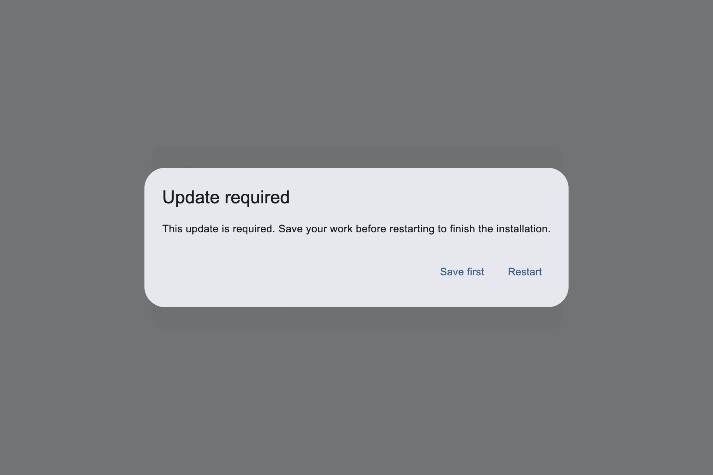
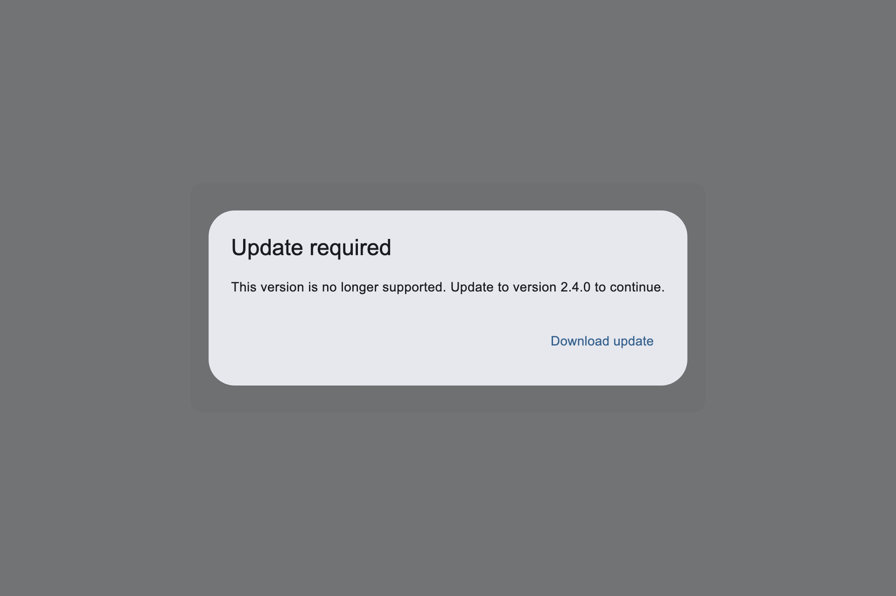
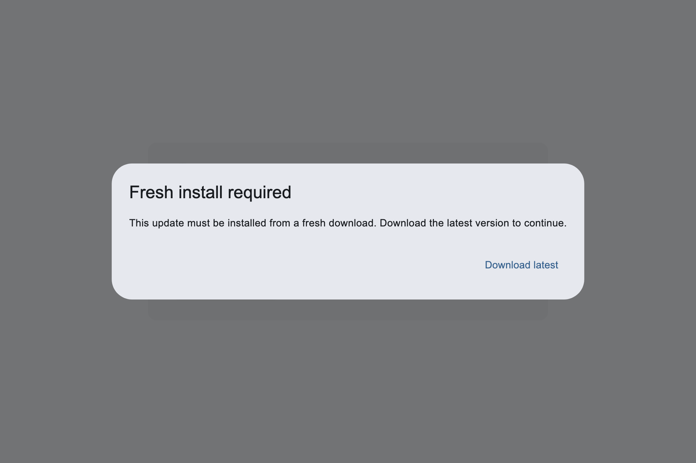

# Issue #57 Update Policy Response

This issue exposed two separate concerns:

- mandatory update UX after an update has already been downloaded
- broader fail-safe policy for old or unsafe clients

The immediate fix should stay small: mandatory updates must not be skippable, but
users still need a safe way to save unsaved work before restarting.

## 1. Optional Update

Optional updates are soft prompts.

- Show `Download`
- Show `Skip this version`
- Restart confirmation can show `Not now`
- A persisted skipped version is allowed when the app supplies `UpdatePreferences`

```json
{
  "version": "2.4.0",
  "buildNumber": 240,
  "platform": "macos",
  "channel": "stable",
  "mandatory": false,
  "release": "https://updates.example.com/releases/2.4.0/macos/release.json"
}
```

## 2. Mandatory Update

Mandatory updates are required, but they should not destroy user work.

- Hide `Skip this version`
- Ignore persisted skipped versions
- Keep showing the update on every app launch until installed
- After download, keep the mandatory flag through `UpdateReadyToInstall`
- Restart confirmation shows `Save first` + `Restart`
- `Save first` only closes the confirmation; it does not skip the update

```json
{
  "version": "2.4.0",
  "buildNumber": 240,
  "platform": "macos",
  "channel": "stable",
  "mandatory": true,
  "release": "https://updates.example.com/releases/2.4.0/macos/release.json"
}
```

Screenshot:



## 3. Support Policy

`supportPolicy` is the fail-safe boundary: this app version is accepted only
until a deadline.

Recommended location: top-level `app-archive.json`, because the app needs this
policy before it downloads an artifact.

```json
{
  "schemaVersion": 3,
  "appName": "Example App",
  "supportPolicy": {
    "minimumSupportedVersion": "2.4.0",
    "enforcedAfter": "2026-07-15T00:00:00Z"
  },
  "items": [
    {
      "version": "2.4.0",
      "buildNumber": 240,
      "platform": "macos",
      "channel": "stable",
      "mandatory": true,
      "release": "https://updates.example.com/releases/2.4.0/macos/release.json"
    }
  ]
}
```

Recommended behavior:

- Missing `supportPolicy`: do nothing
- Before `enforcedAfter`: warn strongly, but allow app usage
- After `enforcedAfter`: block normal app usage and show required update UI
- For mandatory releases, recommend adding `supportPolicy` when the update is
  security-critical or protocol-breaking

Screenshot concept:



## 4. Fresh Install

`freshInstall` is separate from mandatory. It means the in-app updater is not the
right install path for this release.

Recommended location: item-level `app-archive.json`, because the requirement can
be specific to one release, platform, channel, package layout, signing change,
or updater-runtime transition.

```json
{
  "version": "2.4.0",
  "buildNumber": 240,
  "platform": "macos",
  "channel": "stable",
  "mandatory": true,
  "freshInstall": {
    "downloadUrl": "https://example.com/download/latest",
    "message": "This update must be installed from a fresh download."
  },
  "release": "https://updates.example.com/releases/2.4.0/macos/release.json"
}
```

Recommended behavior:

- Missing `freshInstall`: use the normal in-app update flow
- Present `freshInstall`: show the ready-made fresh-install UI
- `downloadUrl` is required
- `message` is optional and release-specific
- Default title/body/button copy should live in Flutter localization, not in JSON
- Custom UI can override the ready-made UI by rendering from controller state

Screenshot concept:



## CLI

The current `--mandatory` flag remains the release-item switch.

```sh
dart run desktop_updater:release publish \
  --platform macos \
  --mandatory
```

Policy flags are generated only when explicitly provided:

```sh
dart run desktop_updater:release publish \
  --platform macos \
  --mandatory \
  --minimum-supported-version 2.4.0 \
  --enforced-after 2026-07-15T00:00:00Z \
  --fresh-install-url https://example.com/download/latest \
  --fresh-install-message "This update must be installed from a fresh download."
```

Generation rules:

- If `--minimum-supported-version` and `--enforced-after` are both absent,
  `supportPolicy` is omitted
- If one support-policy flag is present, the other is required
- If `--fresh-install-url` is absent, `freshInstall` is omitted
- `--fresh-install-message` is only valid with `--fresh-install-url`
- Do not generate `messages` blocks in JSON; use `DesktopUpdateLocalization`
  for translatable default copy

## Current Implementation Scope

Implemented now:

- mandatory state is preserved after download/staging
- ready-made restart prompts show `Save first` + `Restart` for mandatory updates
- `Save first` is localizable via `DesktopUpdateLocalization.saveFirstText`
- optional updates keep existing `Not now` behavior
- `supportPolicy` parsing, CLI generation, runtime state, ready-made UI, custom
  UI state, and tests
- `freshInstall` parsing, CLI generation, runtime state, ready-made UI, custom
  UI state, external download launcher, and tests
- README keeps only a short pointer to `docs/publishing.md#update-policy-modes`
- `docs/publishing.md` explains optional, mandatory, support-policy, and
  fresh-install behavior in detail
